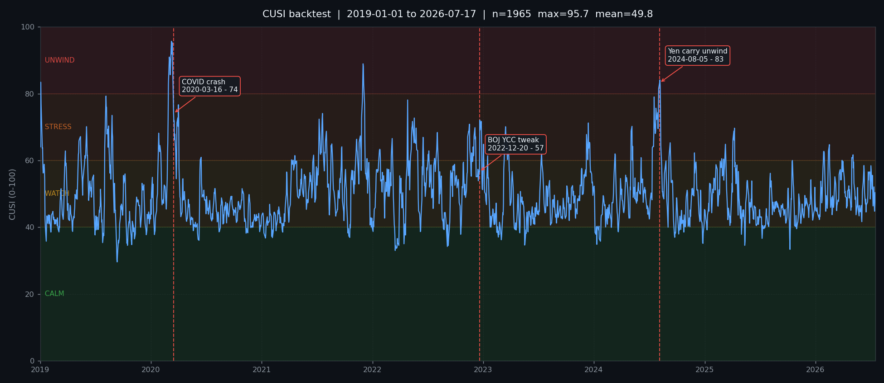

# CUSI Backtest Validation Report — Phase 4

> สร้างโดย `backtest/validate_cusi.py` เมื่อ 2026-07-18 16:48  
> ช่วงข้อมูล **2019-01-01 → 2026-07-17** (1965 วันทำการ)  
> เกณฑ์สัญญาณ CUSI ≥ **60** · นิยาม "เหตุการณ์": SPX drawdown > 5% หรือ USDJPY −3% ภายใน 20 วันทำการ

## สรุปสั้น

* เกณฑ์หลักของ spec §3.4 — Aug 2024 ต้องขึ้นถึง ≥ 80: **ผ่าน** (จุดสูงสุด **84.1** เมื่อ 2024-08-06)
* Event study: ผ่าน 2 / 2 เหตุการณ์ที่มีเกณฑ์กำหนด
* Precision: 21.1% (8 จาก 38 สัญญาณ ตามด้วยเหตุการณ์จริง)
* Recall: 58.8% (10 จาก 17 เหตุการณ์ถูกเตือนล่วงหน้า)
* Lead time เฉลี่ย **9.2 วัน** (median 2.0 วัน)

## 1. ความครบของข้อมูล

ช่วงที่ component ไหนไม่มีข้อมูล ระบบจะ **re-normalize น้ำหนักที่เหลือ** ให้อัตโนมัติ 
(ไม่ได้แทนค่าด้วย z = 0 ซึ่งจะดึงผลเข้าหา 50 อย่างไม่มีเหตุผล)

ตัวหาร = **1967 วันทำการ** (ไม่ใช่ 2756 แถวใน frame — frame รวมเสาร์–อาทิตย์มาด้วยเพราะ BTC เทรด 24/7)

| Component | น้ำหนัก | วันที่มีข้อมูล | ความครบ |
|---|---:|---:|---:|
| jpy_momentum | 20% | 1963 | 99.8% |
| audjpy_drawdown | 15% | 1964 | 99.8% |
| spread_compression | 15% | 1961 | 99.7% |
| vix | 15% | 1896 | 96.4% |
| fx_realized_vol | 10% | 1963 | 99.8% |
| cot_positioning * | 10% | 2756 | 100.0% |
| move | 5% | 1877 | 95.4% |
| nikkei_momentum | 5% | 1838 | 93.4% |
| mxnjpy_drawdown | 5% | 1963 | 99.8% |

\* COT เป็นข้อมูลรายสัปดาห์ที่ถูก forward-fill เป็นรายวัน จำนวนวันจึงเกินวันทำการได้ (ค่าถูก ffill ข้ามวันหยุดด้วย) — ไม่ได้แปลว่าข้อมูลดีกว่าตัวอื่น

## 2. Event Study

เทียบค่า CUSI ณ วันเกิดเหตุ กับ 10 วันทำการก่อนหน้า — 
ถ้า CUSI ยกตัวขึ้น**ก่อน**วันเกิดเหตุ แปลว่าเป็น leading indicator ไม่ใช่ lagging

| เหตุการณ์ | วันที่ | CUSI 10d ก่อน | CUSI วันเกิดเหตุ | เปลี่ยนแปลง | จุดสูงสุด (±20d) | ระดับสูงสุด | เกณฑ์ | ผล |
|---|---|---:|---:|---:|---:|---|---|---|
| COVID crash | 2020-03-16 | 91.0 | 74.1 | -16.9 | 95.7 | UNWIND | STRESS | ✅ |
| BOJ YCC tweak | 2022-12-20 | 66.4 | 56.7 | -9.7 | 72.1 | STRESS | — | — |
| Yen carry unwind | 2024-08-05 | 68.1 | 83.2 | 15.2 | 84.1 | UNWIND | UNWIND | ✅ |

## 3. Signal Analysis (False Positive)

นับเฉพาะ **episode** ไม่ใช่รายวัน — ช่วงที่ CUSI อยู่เหนือ 60 ติดกัน (หรือห่างกันไม่เกิน 10 วัน) ถือเป็นสัญญาณเดียว

| # | เริ่มสัญญาณ | จุดสูงสุด | วันที่พีค | ระยะ (วัน) | SPX แย่สุด | USDJPY แย่สุด | ผล (เข้ม) | ผล (ผ่อน) |
|---:|---|---:|---|---:|---:|---:|---|---|
| 1 | 2019-01-01 | 83.4 | 2019-01-03 | 7 | -2.4% | -2.0% | ❌ | ❌ |
| 2 | 2019-03-25 | 62.9 | 2019-03-25 | 1 | 0.3% | -0.0% | ❌ | ❌ |
| 3 | 2019-05-07 | 67.1 | 2019-05-14 | 8 | -4.8% | -2.5% | ❌ | ❌ |
| 4 | 2019-05-28 | 70.1 | 2019-06-03 | 8 | -2.1% | -2.0% | ❌ | ❌ |
| 5 | 2019-08-02 | 79.3 | 2019-08-06 | 19 | -3.1% | -2.4% | ❌ | ❌ |
| 6 | 2020-01-27 | 68.2 | 2020-01-27 | 6 | -3.6% | -0.4% | ❌ | ✅ |
| 7 | 2020-02-25 | 95.7 | 2020-03-09 | 28 | -28.5% | -7.0% | ✅ SPX -28.5% + USDJPY -7.0% | ✅ |
| 8 | 2020-06-12 | 61.0 | 2020-06-15 | 2 | -1.1% | -0.3% | ❌ | ❌ |
| 9 | 2021-04-09 | 61.5 | 2021-04-20 | 9 | -0.1% | -1.3% | ❌ | ❌ |
| 10 | 2021-06-21 | 61.6 | 2021-06-21 | 1 | 0.4% | -0.4% | ❌ | ❌ |
| 11 | 2021-07-07 | 74.1 | 2021-07-20 | 21 | -2.3% | -1.5% | ❌ | ❌ |
| 12 | 2021-08-18 | 65.0 | 2021-08-20 | 3 | 0.1% | 0.1% | ❌ | ❌ |
| 13 | 2021-09-21 | 64.1 | 2021-09-22 | 2 | -1.2% | -0.3% | ❌ | ❌ |
| 14 | 2021-11-08 | 88.9 | 2021-12-01 | 27 | -4.0% | -0.5% | ❌ | ✅ |
| 15 | 2022-01-24 | 63.3 | 2022-01-25 | 4 | -2.4% | 0.1% | ❌ | ❌ |
| 16 | 2022-03-04 | 66.6 | 2022-03-07 | 3 | -3.7% | -0.5% | ❌ | ❌ |
| 17 | 2022-04-26 | 78.1 | 2022-04-27 | 25 | -6.6% | -0.4% | ✅ SPX -6.6% | ✅ |
| 18 | 2022-06-16 | 66.9 | 2022-06-17 | 2 | 0.2% | -1.3% | ❌ | ❌ |
| 19 | 2022-07-04 | 62.9 | 2022-07-06 | 3 | -0.9% | -1.2% | ❌ | ❌ |
| 20 | 2022-07-25 | 68.4 | 2022-08-03 | 10 | -1.2% | -3.5% | ✅ USDJPY -3.5% | ✅ |
| 21 | 2022-11-11 | 70.9 | 2022-11-17 | 20 | -1.5% | -5.1% | ✅ USDJPY -5.1% | ✅ |
| 22 | 2022-12-21 | 72.1 | 2022-12-21 | 19 | -2.5% | -2.9% | ❌ | ❌ |
| 23 | 2023-03-13 | 70.1 | 2023-03-16 | 11 | 0.9% | -3.1% | ✅ USDJPY -3.1% | ✅ |
| 24 | 2023-07-12 | 62.0 | 2023-07-13 | 2 | -0.1% | -1.5% | ❌ | ❌ |
| 25 | 2023-12-08 | 71.2 | 2023-12-14 | 8 | 0.4% | -2.3% | ❌ | ❌ |
| 26 | 2024-03-11 | 62.0 | 2024-03-11 | 2 | -0.0% | -0.0% | ❌ | ❌ |
| 27 | 2024-05-03 | 70.2 | 2024-05-06 | 4 | 1.0% | 0.3% | ❌ | ❌ |
| 28 | 2024-06-05 | 60.8 | 2024-06-05 | 1 | -0.1% | 0.4% | ❌ | ❌ |
| 29 | 2024-07-12 | 84.1 | 2024-08-06 | 21 | -7.6% | -8.5% | ✅ SPX -7.6% + USDJPY -8.5% | ✅ |
| 30 | 2024-09-05 | 65.3 | 2024-09-09 | 4 | -1.7% | -1.8% | ❌ | ❌ |
| 31 | 2024-11-28 | 62.3 | 2024-11-28 | 1 | -2.2% | -1.2% | ❌ | ❌ |
| 32 | 2025-02-26 | 64.9 | 2025-03-10 | 10 | -7.3% | -1.3% | ✅ SPX -7.3% | ✅ |
| 33 | 2025-04-03 | 69.7 | 2025-04-09 | 5 | -7.7% | -4.7% | ✅ SPX -7.7% + USDJPY -4.7% | ✅ |
| 34 | 2025-10-17 | 60.0 | 2025-10-17 | 1 | 0.5% | 0.4% | ❌ | ❌ |
| 35 | 2026-01-28 | 62.7 | 2026-01-29 | 3 | -2.6% | 0.2% | ❌ | ❌ |
| 36 | 2026-02-13 | 64.7 | 2026-02-16 | 2 | -3.0% | -0.0% | ❌ | ❌ |
| 37 | 2026-03-30 | 60.0 | 2026-03-30 | 1 | 2.9% | -1.0% | ❌ | ❌ |
| 38 | 2026-05-01 | 61.7 | 2026-05-05 | 3 | -0.4% | -0.3% | ❌ | ❌ |

รายงานสองนิยาม เพราะผลต่างกันมากและการเลือกนิยามเดียวจะเป็นการเลือกตัวเลขที่ชอบ:

* **เข้ม** (นับ 20 วันจากวันข้ามเส้นเท่านั้น — ตรงตามตัวอักษรของ spec): จริง 8 · เท็จ 30 · precision **21.1%**
* **ผ่อน** (ให้เวลาถึงวันสุดท้ายที่ยังเตือนอยู่ + 20 วัน): จริง 10 · เท็จ 28 · precision **26.3%**

นิยามผ่อนมีเหตุผลรองรับ: สัญญาณที่ค้างอยู่ 40 วันแล้วเกิดเหตุในวันที่ 30 
ไม่ควรถูกนับเป็น false positive เพราะระบบยังเตือนอยู่ตลอด 
แต่ก็เอนเอียงเข้าข้างโมเดลเช่นกัน — ความจริงอยู่ระหว่างสองค่านี้

## 4. Lead Time Analysis

เหตุการณ์ตรงนี้นิยามจาก**ราคาอย่างเดียว** ไม่ได้ดู CUSI เลย 
(drawdown จากจุดสูงสุด 20 วัน) แล้วค่อยย้อนดูว่า CUSI เตือนก่อนไหม

| # | เหตุการณ์เริ่ม | ความรุนแรง | CUSI เตือนวันที่ | นำหน้า (วัน) | พีคของสัญญาณ | CUSI สูงสุด 20d ก่อน |
|---:|---|---|---|---:|---:|---:|
| 1 | 2019-01-01 ⚠️ขอบข้อมูล | SPX -10.0% / USDJPY -5.4% | 2019-01-01 | 0 | 83.4 | — |
| 2 | 2019-05-29 | SPX -6.6% / USDJPY -2.3% | 2019-05-28 | 1 | 70.1 | 67.1 |
| 3 | 2019-08-05 | SPX -6.1% / USDJPY -3.7% | 2019-08-02 | 3 | 79.3 | 64.1 |
| 4 | 2020-02-25 | SPX -29.5% / USDJPY -7.9% | 2020-02-25 | 0 | 95.7 | 65.1 |
| 5 | 2020-06-11 | SPX -7.1% / USDJPY -2.9% | — | — | ❌ พลาด | 49.3 |
| 6 | 2020-09-08 | SPX -9.6% / USDJPY -2.0% | — | — | ❌ พลาด | 48.8 |
| 7 | 2021-09-30 | SPX -5.1% / USDJPY 0.0% | 2021-09-21 | 9 | 64.1 | 64.1 |
| 8 | 2022-01-19 | SPX -12.8% / USDJPY -8.3% | — | — | ❌ พลาด | 57.3 |
| 9 | 2023-07-12 | SPX -0.7% / USDJPY -4.6% | 2023-07-12 | 0 | 62.0 | 59.5 |
| 10 | 2023-09-26 | SPX -6.1% / USDJPY -1.0% | — | — | ❌ พลาด | 48.7 |
| 11 | 2023-11-29 | SPX -1.6% / USDJPY -5.3% | — | — | ❌ พลาด | 57.6 |
| 12 | 2024-04-19 | SPX -5.5% / USDJPY -3.3% | 2024-03-11 | 39 | 62.0 | 55.6 |
| 13 | 2024-07-18 | SPX -8.5% / USDJPY -10.4% | 2024-07-12 | 6 | 84.1 | 68.1 |
| 14 | 2024-11-28 | SPX -0.9% / USDJPY -4.4% | 2024-11-28 | 0 | 62.3 | 53.3 |
| 15 | 2025-02-06 | SPX -13.7% / USDJPY -6.6% | — | — | ❌ พลาด | 54.7 |
| 16 | 2025-11-20 | SPX -5.1% / USDJPY 0.0% | 2025-10-17 | 34 | 60.0 | 50.0 |
| 17 | 2026-01-27 | SPX -7.7% / USDJPY -4.2% | — | — | ❌ พลาด | 57.8 |

**พารามิเตอร์ที่ต้องเปิดเผย**: การจับคู่สัญญาณกับเหตุการณ์ใช้หน้าต่าง 
`max_lead_days = 60` — สัญญาณที่มาก่อนเหตุการณ์เกินกว่านี้ไม่นับว่าเกี่ยวข้องกัน 
ตัวเลขนี้เป็นการตัดสินใจ ไม่ใช่ข้อเท็จจริง และมีผลต่อ recall โดยตรง:

| max_lead_days | เตือนได้ | Recall | Lead เฉลี่ย |
|---:|---|---:|---:|
| 20 | 8/17 | 47% | 2 วัน |
| 30 | 8/17 | 47% | 2 วัน |
| 60 ←ใช้อยู่ | 10/17 | 59% | 9 วัน |
| 90 | 14/17 | 82% | 28 วัน |

ตัวอย่างที่ชัดที่สุดคือเหตุการณ์ `2022-01-19` (SPX −12.8% / USDJPY −8.3%) ซึ่งถูกนับว่า **พลาด** 
ทั้งที่ CUSI เคยขึ้นไปถึง **88.9 เมื่อ 2021-12-01** — แต่สัญญาณนั้นจบลงตั้งแต่ 2021-12-14 
คือเงียบไปแล้ว 36 วันก่อนเหตุการณ์จริง 
การนับว่า "เตือนสำเร็จ" จึงใจกว้างเกินไป (เตือนแล้วยกเลิก แล้วค่อยเกิดเหตุ = ใช้งานจริงไม่ได้) 
แต่การนับว่าพลาดสนิทก็ทิ้งข้อมูลไป — ค่าจริงอยู่ระหว่างกลาง

**เหตุการณ์ที่พลาด (7 ครั้ง)** — คอลัมน์ขวาสุดบอกว่า CUSI ขึ้นไปสูงสุดเท่าไหร่ก่อนเกิดเหตุ:

* 3 ครั้งพลาดแบบเฉียด (แตะ 55+ แต่ไม่ข้ามเส้น)
* 4 ครั้งพลาดแบบไม่มีสัญญาณเลย

ที่ควรดูเป็นพิเศษคือเหตุการณ์ที่รุนแรงแต่ CUSI เงียบสนิท:

* `2023-09-26` — SPX -6.1% / USDJPY -1.0% · CUSI สูงสุดก่อนหน้าแค่ 48.7
* `2020-09-08` — SPX -9.6% / USDJPY -2.0% · CUSI สูงสุดก่อนหน้าแค่ 48.8
* `2020-06-11` — SPX -7.1% / USDJPY -2.9% · CUSI สูงสุดก่อนหน้าแค่ 49.3

ข้อสังเกต: เหตุการณ์ที่ CUSI เงียบสนิททั้ง 3 ครั้งเป็นการร่วงของ **SPX ล้วน ๆ 
โดย USDJPY แทบไม่ขยับ** (−1.0%, −2.0%, −2.9%) ซึ่งเข้ากับสมมติฐานว่า CUSI 
ถูกออกแบบมาจับ *carry unwind* ไม่ใช่ความเสี่ยงหุ้นทุกชนิด — ดูการทดสอบสมมติฐานนี้ในหัวข้อ 4b

**สรุป**: 17 เหตุการณ์ · เตือนได้ 10 · พลาด 7 · recall **58.8%** · lead time เฉลี่ย **9.2 วัน** (median 2.0)

## 4b. ผลเปลี่ยนแค่ไหนถ้าเปลี่ยนนิยามเหตุการณ์

หัวข้อ 4 ตั้งข้อสังเกตว่า CUSI พลาดเพราะนิยามเหตุการณ์รวมการร่วงของหุ้นทุกสาเหตุ 
หัวข้อนี้ทดสอบข้อสังเกตนั้นตรง ๆ แทนที่จะเชื่อไปเอง (โมเดลและน้ำหนักเหมือนเดิมทุกแบบ):

| นิยามเหตุการณ์ | เหตุการณ์ | Recall | สัญญาณ | Precision | Lead เฉลี่ย |
|---|---:|---:|---:|---:|---:|
| spec: SPX −5% หรือ USDJPY −3% | 17 | 59% | 38 | 21% | 9 วัน |
| carry เท่านั้น: USDJPY −3% | 14 | 71% | 38 | 16% | 5 วัน |
| carry เท่านั้น: USDJPY −4% | 11 | 91% | 38 | 11% | 4 วัน |
| หุ้นเท่านั้น: SPX −5% | 17 | 71% | 38 | 13% | 18 วัน |

**ผลออกมาครึ่งหนึ่งสนับสนุน อีกครึ่งหักล้าง** ข้อสังเกตในหัวข้อ 4:

* ✅ **สนับสนุน** — ถ้านับเฉพาะเหตุการณ์ที่ค่าเงินเยนขยับจริง (USDJPY −4%) recall พุ่งจาก 59% เป็น **91%** แปลว่า CUSI แทบไม่พลาดเหตุการณ์ประเภทที่มันถูกสร้างมาจับ
* ❌ **หักล้าง** — precision **ไม่ดีขึ้นเลย** ในทุกนิยาม (11–21%) เพราะจำนวนสัญญาณคงที่ที่ 38 ครั้งไม่ว่าจะนิยามเหตุการณ์อย่างไร

สรุปตรง ๆ: **การพลาด** อธิบายได้ด้วยนิยามเหตุการณ์ แต่ **การเตือนบ่อยเกิน** อธิบายไม่ได้ 
และเป็นคุณสมบัติจริงของ CUSI ที่เส้น 60 — 38 สัญญาณใน 7.5 ปี ≈ 5 ครั้ง/ปี 
โดยส่วนใหญ่ไม่ตามด้วยอะไรภายใน 20 วัน นี่คือข้อจำกัดที่ผู้ใช้ควรรู้ก่อนเชื่อไฟเตือน

## 5. Confusion-style Summary

| | เกิดเหตุการณ์จริง | ไม่เกิด |
|---|---:|---:|
| **CUSI ≥ 60** | TP = 8 | FP = 30 |
| **CUSI < 60** | FN = 7 | TN = ไม่นิยาม* |

\* TN ไม่มีความหมายในบริบทนี้ เพราะ "วันที่ไม่มีสัญญาณและไม่มีเหตุการณ์" คือวันส่วนใหญ่ 
การนับ TN จะทำให้ accuracy ดูดีเกินจริง — precision/recall สื่อความหมายตรงกว่า

* **Precision 21.1%** — เตือนแล้วเกิดจริงกี่ %  (ค่าต่ำ = เตือนบ่อยเกิน)
* **Recall 58.8%** — เหตุการณ์ที่เกิดจริง ถูกเตือนล่วงหน้ากี่ %  (ค่าต่ำ = พลาดของจริง)

## 5b. Threshold Sweep — precision/recall trade-off

เกณฑ์ 60 มาจาก spec §3.3 ตารางนี้แสดงว่าถ้าขยับเส้นจะได้อะไรเสียอะไร 
(ตัวโมเดลและน้ำหนัก**ไม่เปลี่ยน** — เปลี่ยนแค่จุดที่เรียกว่า "เตือน")

| Threshold | สัญญาณ | Precision (เข้ม) | Precision (ผ่อน) | Recall | เตือนได้ | Lead เฉลี่ย |
|---:|---:|---:|---:|---:|---|---:|
| **50** | 45 | 28.9% | 33.3% | 94.1% | 16/17 | 15.9 วัน |
| **55** | 43 | 32.6% | 37.2% | 88.2% | 15/17 | 6.5 วัน |
| **60** ←ปัจจุบัน | 38 | 21.1% | 26.3% | 58.8% | 10/17 | 9.2 วัน |
| **65** | 22 | 27.3% | 31.8% | 29.4% | 5/17 | 10.0 วัน |
| **70** | 14 | 28.6% | 35.7% | 17.6% | 3/17 | 18.0 วัน |
| **75** | 7 | 42.9% | 42.9% | 17.6% | 3/17 | 17.0 วัน |
| **80** | 4 | 50.0% | 50.0% | 5.9% | 1/17 | 50.0 วัน |

อ่านตารางนี้อย่างไร: ยกเส้นสูงขึ้น = เตือนน้อยลงแต่แม่นขึ้น และเสีย lead time 
เลือกจุดตามว่าอะไรแพงกว่าสำหรับผู้ใช้ — เตือนผิดบ่อย (เหนื่อย เลิกสนใจ) 
หรือพลาดของจริง (เจ็บตัว)

**คำเตือนสำคัญเรื่องการอ่านตารางนี้**: precision ในคอลัมน์นี้ *ไม่ได้* เรียงขึ้นลงตาม threshold 
อย่างเป็นระบบ (55 ได้สูงกว่า 60) ซึ่งดูเหมือนมีความหมาย แต่จำนวนสัญญาณน้อยเกินไป — 
ที่ n ≈ 40 และ p ≈ 0.25 ค่า standard error อยู่ที่ ~7 จุด และช่วงความเชื่อมั่น 95% 
ของทุก threshold **ทับซ้อนกันเกือบทั้งหมด**:

| Threshold | Precision | 95% CI โดยประมาณ |
|---:|---:|---|
| 50 | 28.9% | [16%, 42%] |
| 55 | 32.6% | [19%, 47%] |
| 60 | 21.1% | [8%, 34%] |
| 65 | 27.3% | [9%, 46%] |
| 70 | 28.6% | [5%, 52%] |
| 75 | 42.9% | [6%, 80%] |
| 80 | 50.0% | [1%, 99%] |

แปลว่า **ยังสรุปไม่ได้ว่า threshold ไหนดีกว่ากันจริง** 
การเลือก 55 หรือ 75 เพราะตัวเลข precision ในตารางนี้ คือการ fit กับ noise 
ถ้าจะขยับเส้น ควรขยับด้วยเหตุผลเชิงการใช้งาน (เช่น อยากให้ CALM มีความหมาย) 
ไม่ใช่เพราะตัวเลขในตารางนี้

## 6. การกระจายของระดับ

| ระดับ | จำนวนวัน | สัดส่วน |
|---|---:|---:|
| CALM | 177 | 9.0% |
| WATCH | 1535 | 78.1% |
| STRESS | 233 | 11.9% |
| UNWIND | 20 | 1.0% |

สถิติ: min 29.6 · median 48.0 · mean 49.8 · max 95.7 · sd 9.2

## 7. Component Diagnosis ณ Aug 2024

| Component | z | น้ำหนัก | contribution | สัดส่วน |
|---|---:|---:|---:|---:|
| jpy_momentum | 3.00 | 0.20 | 0.600 | 26.9% |
| audjpy_drawdown | 3.00 | 0.15 | 0.450 | 20.2% |
| vix | 3.00 | 0.15 | 0.450 | 20.2% |
| fx_realized_vol | 1.65 | 0.10 | 0.165 | 7.4% |
| nikkei_momentum | 3.00 | 0.05 | 0.150 | 6.7% |
| mxnjpy_drawdown | 3.00 | 0.05 | 0.150 | 6.7% |
| spread_compression | 0.63 | 0.15 | 0.095 | 4.3% |
| move | 1.07 | 0.05 | 0.053 | 2.4% |
| cot_positioning | -1.19 | 0.10 | -0.119 | 5.3% |

## 8. คำแนะนำเรื่อง weights

**ไม่แนะนำให้ปรับน้ำหนัก**

เกณฑ์หลักที่ spec §3.4 ตั้งไว้คือ Aug 2024 ต้องขึ้นถึง ≥ 80 — ผลจริงคือ **84.1** ซึ่งผ่านแล้วโดยใช้น้ำหนัก v1 จาก §3.2 **ที่ยังไม่เคยแตะเลย**

spec §5 Phase 4 อนุญาตให้ปรับได้ 1 รอบ *เฉพาะกรณีที่ไม่ผ่าน* — 
เมื่อผ่านแล้วการปรับต่อมีแต่ downside: ทุกการขยับจากตรงนี้คือการ fit 
กับ 3 เหตุการณ์ในชุดข้อมูลเดียว ซึ่งเป็นนิยามของ curve-fitting ที่ spec §6 เตือนไว้ 
น้ำหนัก v1 ที่ไม่เคยถูกปรับคือ out-of-sample โดยธรรมชาติ — เป็นทรัพย์สินที่เสียไปแล้วเรียกคืนไม่ได้

**สิ่งที่ควรทำแทนการปรับน้ำหนัก** (ถ้าอยากให้ระบบใช้งานได้ดีขึ้น):

1. ปรับ **threshold** ไม่ใช่ weights — ดูหัวข้อ 6 ว่าการกระจายระดับเบ้ไปทาง WATCH แค่ไหน 
   threshold เป็น cosmetic ต่อการจัดอันดับความเสี่ยง แต่ weights เปลี่ยนตัวโมเดลเอง
2. เก็บ CUSI แบบ live ไปเรื่อย ๆ แล้วค่อยประเมินใหม่ด้วยข้อมูล out-of-sample จริง
3. ถ้าจะปรับจริง ให้ทำหลังมี episode ใหม่อย่างน้อย 2–3 ครั้งที่ระบบไม่เคยเห็น

## 9. ข้อจำกัดของการทดสอบนี้

* **In-sample ทั้งหมด** — น้ำหนักถูกกำหนดไว้ก่อนเห็นข้อมูล (ดี) แต่การเลือก *ตัวชี้วัด* และ *สูตร* ทำขึ้นหลังปี 2024 ซึ่งเป็นช่วงที่ทุกคนรู้แล้วว่า Aug 2024 เกิดอะไร
* **ตัวอย่างน้อย** — เหตุการณ์ระดับ unwind จริง ๆ มีไม่กี่ครั้งในชุดข้อมูล สถิติ precision/recall จึงมี error bar กว้างมาก
* **นิยามเหตุการณ์เป็นทางเลือกหนึ่ง** — SPX −5% / USDJPY −3% ใน 20 วัน ถ้าเปลี่ยนเกณฑ์ ตัวเลข precision/recall จะเปลี่ยนตาม
* **ข้อมูลย้อนหลังผ่าน yfinance** อาจมี survivorship / revision ที่ตรวจสอบไม่ได้

---

_รายงานนี้สร้างอัตโนมัติ — รันซ้ำได้ด้วย `python backtest/validate_cusi.py`_
